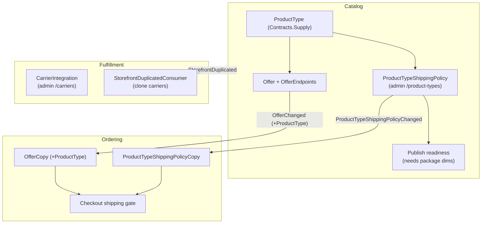

# ADR-0042: Physical-shipping model — shippability gate, package dimensions, per-storefront carriers, and product-type shipping policy

Status: Accepted
Date: 2026-08-05

## Context

Until now the platform treated "does this order need shipping?" implicitly. Every cart was
offered a flat shipping charge, physical products had no enforced weight/dimensions, carriers
existed only as an API with no operator screen, duplicating a storefront lost its carrier
accounts, and there was no way for an operator to say *which kinds of product actually need a
carrier*. This ADR records the decisions that turn shipping into an explicit, configurable,
per-storefront concern.

The work shipped as five feature slices plus two follow-up fixes (PRs #163–#169).

## Decisions

### 1. Shipping is charged only when the cart has a shippable line

Checkout resolves each line's fulfilment type from the local `OfferCopy` read model and charges
shipping **only if at least one line is shippable**. A cart that is entirely digital / subscription
/ usage / manual-service ships nothing and is never charged shipping — regardless of what the
client sends.

**Rule:** `FulfilmentTypeExtensions.RequiresShipping()` returns `false` for
`DigitalDownload`, `Subscription`, `Usage`, and `ManualService`; everything else (including
`Unassigned`, so a physical good with no projected offer never *loses* shipping) is shippable.

### 2. A physical product cannot be published without weight + dimensions

A shippable product carries two sets of measurements on every variant — the **item** (weight +
H×W×D) and the **package** it ships in (boxed weight + H×W×D), because carriers rate the parcel,
not the bare item. Publishing is **blocked** until every visible variant of a shippable product
has all eight values.

**Rule:** `Variant.HasShippingDimensions` is true only when all four item and all four package
measurements are present and positive. `ProductPublication.CheckReadiness(product, requiresShipping)`
adds a missing-requirement when `requiresShipping` and any visible variant lacks them.

### 3. Which product types require a carrier is a per-tenant policy

Operators manage a **Product Types** policy: for each `ProductType`
(Physical / Digital / Service / Bundle / Subscription / UsageBased) a toggle says whether it needs
shipping and a carrier. Default: **Physical only**.

The policy drives two places:

- **Publish readiness** (decision 2) — a product whose type requires shipping needs its dimensions.
- **Checkout** (decision 1) — the shipping charge is gated by the policy applied to each line's
  product type, falling back to the fulfilment-type gate when the policy or the line's type is
  unknown.

**Rule:** `ProductTypeShippingPolicy` stores the shippable set as an ordered CSV of enum names
(`"Physical,Bundle"`). A tenant with no explicit policy behaves as *Physical ships*.

### 4. Carriers are managed per storefront, with credentials by reference

A tenant configures carriers at the **tenant level** (the default) and may **override per
storefront**, so each storefront keeps its own independent carrier accounts. A carrier row never
holds a secret — only a `CredentialRef` pointing at the secret store. Lifecycle is
Draft → Active → Suspended/Disabled; a real carrier needs a credential before it can activate;
`Fake` is keyless for dev/test. Resolution prefers a storefront-scoped active default over the
tenant default.

### 5. Duplicating a storefront clones its carrier accounts

When a storefront is duplicated, its per-storefront carrier rows (config + credential reference +
status + default flag) are copied to the new storefront. Tenant-level carriers are **not** copied —
they already apply to every storefront via default resolution.

### 6. A $0 order settles cleanly (ledger safety)

Because a non-shippable cart now legitimately costs $0 (e.g. a usage-metered product with no
upfront price and no shipping), the ledger must tolerate a zero-value sale. The `Debit`/`Credit`
primitives skip zero-value lines (a zero line is never valid double-entry and violates the
`ck_line_one_side` constraint), the fake PSP charges no fee on a $0 amount, and a $0 order posts no
journal entry at all while still confirming.

## How the pieces fit together (dependencies)

Key dependencies explained:

- **`ProductType` lives in `BuildingBlocks.Contracts.Supply`** (beside `FulfilmentType` and
  `SupplyCategory`). It was moved out of `Catalog.Domain` so Ordering can name it on the contract
  and read model. The int values are unchanged (Physical=1 … UsageBased=6), so no data migration.
- **Catalog → Ordering is eventual-consistency via events (ADR-0008).** Ordering never queries
  Catalog at checkout; it reads local copies kept current by two consumers:
  - `OfferChanged` (now carries `ProductType`) → `OfferCopy`.
  - `ProductTypeShippingPolicyChanged` → `ProductTypeShippingPolicyCopy`.
  Both are published from Catalog **inside the outbox transaction** so the fact commits with the
  write (publishing after `SaveChanges` would strand the row).
- **Catalog → Fulfillment for duplication.** The Catalog storefront-duplicate endpoint publishes
  `StorefrontDuplicated`; Fulfillment's consumer clones the carrier rows. Idempotent by
  (tenant, new storefront) so a redelivered event is a no-op.
- **Back-compat is by "unknown = fall back".** A new column defaults existing `OfferCopy` rows to
  `ProductType = 0` (no enum member). Checkout treats 0 as *unknown* and uses the fulfilment-type
  gate for that line until the offer is next projected — so a deploy never changes in-flight orders,
  and a tenant with no policy copy behaves exactly as before.

## Consequences

- Operators get two new admin screens (`/carriers`, `/product-types`) and a real publish gate for
  physical goods.
- The shipping charge is now driven by operator-configurable policy rather than a hard-coded rule,
  while remaining correct by default (Physical ships) with zero configuration.
- Two new cross-service contracts (`ProductTypeShippingPolicyChanged`, `StorefrontDuplicated`) and
  one extended contract (`OfferChanged`); each is additive and back-compatible.
- The ledger is now safe for genuinely free orders.

## Related

- ADR-0003 per-line-item fulfilment source · ADR-0028 product supply profiles (Offer) ·
  ADR-0008 database-per-service with local read copies · ADR-0016 global shipping ·
  ADR-0041 per-store order costs (carrier cost accrual).
