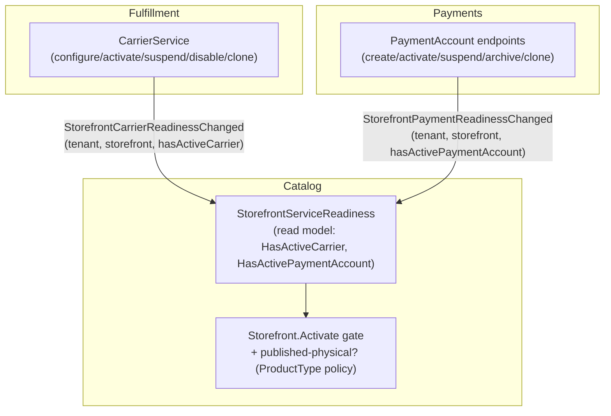

# ADR-0043: Storefront-scoped carriers & payment accounts, and a storefront go-live gate

Status: Accepted
Date: 2026-08-06

## Context

ADR-0042 introduced carriers with a tenant-level default plus per-storefront overrides, and left payment
accounts tenant-level with a per-storefront option. Operationally that was wrong for this platform:
each storefront is its own selling front with its own logistics and its own money rails. There is no
meaningful "tenant default carrier" or "tenant default payment account" — a shipment or a charge always
happens *in a storefront*. This ADR makes both strictly per-storefront and adds the natural consequence:
a storefront can't go live until it can actually take money (and ship, if it sells physical goods).

Shipped as three slices (PRs #172–#174), refining ADR-0042.

## Decisions

### 1. Carriers are per-storefront only

A `CarrierIntegration` always belongs to a storefront (`StorefrontId` is required). There is no
tenant-level carrier and no tenant fallback in resolution — a storefront resolves *its own* active
default carrier or none. Duplicating a storefront clones its carrier accounts (config + credential
reference + status + default), unchanged from ADR-0042 decision 5.

### 2. Payment accounts are per-storefront only

A `PaymentAccount` always belongs to a storefront (`StorefrontId` required); the default flag is
`IsDefaultForStorefront` (one default per storefront). At checkout, the acquiring account is resolved
**within the order's storefront** (no tenant-wide lookup); with none configured it degrades to the
synthetic host default so dev/checkout never crashes. Duplicating a storefront clones its payment
accounts (new Payments consumer of `StorefrontDuplicated`).

### 3. A storefront can't go live without the ability to charge — and to ship, if physical

`Storefront.Activate` (Draft/Paused → Active) now requires, on top of the domain/visibility rules:

- an **active payment account** for the storefront, and
- an **active carrier** for the storefront **when it lists a published product whose type requires
  shipping** (per the tenant's `ProductTypeShippingPolicy`, ADR-0042).

Preview does not gate — you can preview a store before wiring money/shipping; **going live** is what's
blocked.

## How the pieces fit together (dependencies)

The gate lives in Catalog, but carriers live in Fulfillment and payment accounts live in Payments. Catalog
never queries them synchronously (ADR-0008); each service publishes a per-storefront **readiness boolean**
that Catalog projects into a local read model.

Key dependencies:

- **Two new readiness events** — `StorefrontCarrierReadinessChanged` (Contracts.Fulfillment) and
  `StorefrontPaymentReadinessChanged` (Contracts.Payments). Each carries the *current* boolean, so a
  redelivery just re-asserts the truth (idempotent). Republished on every carrier/account mutation and
  when duplication clones accounts.
- **Catalog read model** `StorefrontServiceReadiness` (keyed by storefront) is updated by two consumers.
  An absent row = "not ready" (neither signal seen), so a brand-new storefront is correctly blocked.
- **The gate reads three things** at activation: the read model's two booleans, and — from Catalog's own
  data — whether any *published* product on the storefront is of a type the tenant policy marks shippable
  (that's what makes a carrier mandatory). The domain method keeps a back-compatible overload so callers
  that don't consult the signals still get the pure domain/visibility check.
- **Eventual consistency is fine here.** Readiness is an idempotent boolean gating a manual admin action;
  a briefly-stale flag self-heals on the next carrier/account change. It is deliberately *not* on the
  money path — checkout still resolves the acquiring account directly (decision 2).

## Consequences

- The admin **Carriers** and **Payment accounts** pages require a storefront; there is no tenant-default
  option. Each storefront owns its logistics and money rails, and duplication carries both.
- A misconfigured storefront cannot be activated — operators get a concrete "missing an active payment
  account / an active carrier" reason instead of a store that silently can't sell.
- Three additive/back-compatible contracts; two Catalog consumers; migrations on Fulfillment, Payments,
  and Catalog (dropping the now-invalid tenant-level rows).

## Related

- Refines ADR-0042 (physical-shipping model; its carrier decision 4 — tenant default + override — is
  superseded by decision 1 here). ADR-0028 (Offer / supply). ADR-0008 (local read copies).
