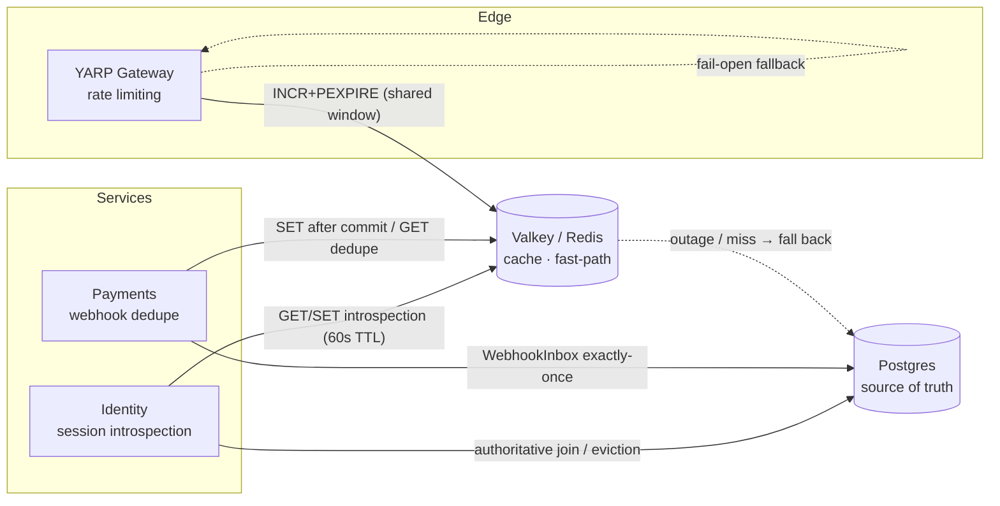

# ADR-0044: Self-hosted Redis (Valkey) for shared sessions, distributed rate limiting, and idempotency fast-path

Status: Accepted

## Context

Three cross-instance concerns were either incorrect when the platform scales out, or sat on the hot
Postgres path:

- **Rate limiting** ran in-process (`System.Threading.RateLimiting` in the gateway), so each replica had
  its own window — N gateway replicas allowed ~N× the intended limit (a credential-stuffing gap on the
  auth endpoints).
- **Session introspection** — the gateway introspects on *every* authenticated request, and each call ran
  a `Sessions ⋈ Users ⋈ Principals` join in Identity's Postgres.
- **Webhook dedupe** — every provider webhook did a `WebhookInbox` existence check + insert in Payments'
  Postgres, including the duplicate retries providers send.

We wanted a shared, fast store for these without making it a new source of truth for money or auth.

## Decisions

### 1. One self-hosted Valkey, introduced as a cache / fast-path only

We run **Valkey** (BSD-licensed, protocol-compatible Redis drop-in) — single node in dev/CI
(`docker-compose.infra.yml`), **HA (Sentinel/Cluster)** in production (Helm). A shared
`IRedisConnection` (`AddRedis`, `StackExchange.Redis`, `AbortOnConnectFail=false`) degrades to a **safe
no-op** when `ConnectionStrings:Redis` is unset or Redis is down, so bare-runs and CI work unchanged and a
Redis outage never takes the platform down. **Postgres stays authoritative everywhere**; Redis holds only
token *hashes* and derived/transient data, all TTL'd.

### 2. Distributed rate limiting, with a fail-open/closed toggle

The gateway limiter is backed by an atomic Redis fixed-window (`INCR`+`PEXPIRE` Lua) keyed by the existing
partition (`(auth|any):tenant:storefront:ip`), so the limit is correct across replicas.
`RateLimiting:Backend` (`InMemory|Redis`) and `RateLimiting:OnRedisOutage` (`FailOpen|FailClosed`) are
config toggles; default is the legacy `InMemory` so nothing changes until an environment opts in.

### 3. Webhook dedupe fast-path in front of the durable inbox

`PaymentEventProcessor` consults a Redis positive cache (`IDedupeStore`) populated **only after the
`WebhookInbox` row commits**. A confirmed duplicate is dropped before touching Postgres; a miss / outage /
eviction falls through to the `WebhookInbox` check, which remains the exactly-once guarantee. No lost
events by construction.

### 4. Session introspection cache — off by default, evicted at every authority change

`IntrospectAsync` is cache-aside over Redis (`ISessionCache`), **disabled by default**
(`Sessions:Cache:Enabled`) and to be enabled only after a security review. Correctness rests on a 60s TTL
backstop **plus** explicit eviction at every revocation/authority-change site — logout (single token),
credential reset and both `ClaimsVersion++` bumps (make-supplier, RBAC changes) via a per-user hash set
that evicts all of a user's cached sessions. MFA-pending sessions are never cached.

## How the pieces fit together

## Consequences

- Rate limits are correct across replicas; session introspection and duplicate-webhook load come off hot
  Postgres when the flags are on.
- A Redis outage degrades gracefully — rate limiting fails open (or closed, per config), dedupe and the
  session cache fall back to Postgres. Redis is never a hard dependency for correctness.
- New operational surface: a Valkey instance (HA in prod) and its `redis_exporter`; app-level signals on
  the `3commerce.redis` meter and a provisioned `redis-overview` Grafana dashboard.
- Shipped in phases: 0 foundation, 1 rate limiting, 2 webhook dedupe, 3 session cache (off by default).
  A separate MFA-challenge Redis store was deferred — `Session.MfaPending` in Postgres already provides
  cross-instance correctness.

## Related

- ADR-0008 (local read copies / no cross-service SQL), ADR-0009 (bare-run dev topology), ADR-0012
  (server-side sessions, token-hash only), ADR-0039 (payment providers / webhooks).
- Plan: `.ai-shared/plans/self-hosted-redis-sessions-ratelimit-idempotency.md`.
