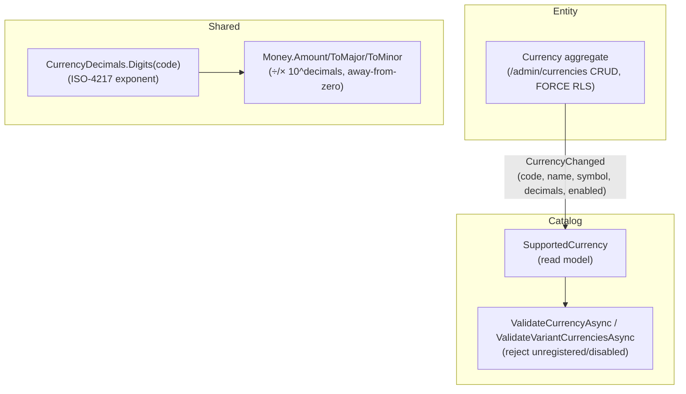

# ADR-0046: A tenant currency registry, and variable-decimal (ISO-4217) money

Status: Accepted
Date: 2026-08-12

## Context

Currency had been an ungoverned free-text field. Storefront config, product per-currency shelf prices
(ADR-0038), and the per-currency ledger (ADR-0040) each accepted whatever three letters a tenant typed,
with no shared answer to two questions: *which* currencies is this tenant allowed to price and settle in,
and *how many decimal places* does a given currency actually have. The second gap was a latent money bug:
amounts are stored as `long …Minor` (smallest unit), but every display and parse divided/multiplied by a
hardcoded 100 — so a 0-decimal currency (JPY: ¥1500 is 1500 minor, not ¥15.00) rendered 100× too small,
and a 3-decimal one (KWD) silently lost a digit.

This ADR records the decisions behind a managed currency registry and currency-aware money, shipped as
three slices (PRs #225 registry, #226 enforcement, #227 variable decimals). It builds on ADR-0038
(per-currency shelf prices), ADR-0040 (per-currency, per-storefront ledger) and ADR-0041 (per-store costs),
all of which already key money by an ISO code but never governed the set of codes or their precision.

## Decisions

### 1. A tenant-scoped, admin-managed currency registry, homed in Entity

The set of currencies a tenant prices, sells and settles in is master/reference data, so it lives in the
**Entity service** per the ADR-0027 boundary — not scattered per consuming service. The aggregate is
`ThreeCommerce.Entity.Domain.Currency`: an immutable ISO-4217 `Code` (3-letter, uppercase, unique per
tenant — changing a code means disable-old/add-new, so historical postings keep a stable reference), plus
editable display metadata `Name` / `Symbol` / `DecimalPlaces` (validated 0–4) and an `Enabled` flag. It is
tenant-scoped under FORCE row-level security (ADR-0024): the `Currencies` table enables and forces RLS with
a `TenantIsolation_Currencies` policy keyed on `app.tenant_id`.

CRUD lives at `/admin/currencies` (`CurrencyEndpoints`, admin-policy). **Every mutation — create, update,
enable, disable — publishes `CurrencyChanged`** (`BuildingBlocks.Contracts.Reference`), carrying the full
current truth (tenant, code, name, symbol, decimal places, enabled) so a redelivery just re-asserts it.

### 2. Enforcement by projection, never a cross-service DB read

Consuming services do not query Entity's database (ADR-0008/0011). Catalog projects `CurrencyChanged` into a
local `SupportedCurrency` read model via `CurrencyProjectionConsumer` (an idempotent upsert, mirroring the
readiness-projection pattern of ADR-0043). Both currency-bearing write paths then validate against that
local copy:

- **Storefront commerce config** — `ValidateCurrencyAsync` in `StorefrontEndpoints`.
- **Product variant base + per-currency prices** — `ValidateVariantCurrenciesAsync` in `AdminEndpoints`.

Either rejects a code that is not registered *and* enabled, with a concrete message ("… is not a registered,
enabled currency. Add or enable it under Currencies first."). Two deliberate escape hatches keep this from
being a footgun: an **empty** value is defaulted downstream (not validated), and a tenant whose registry has
**not projected yet** (a fresh environment, no `SupportedCurrency` rows) is not blocked — enforcement engages
only once the registry exists. Admin currency pickers are registry-driven: `CurrencySelect` loads the tenant's
enabled codes, keeps the current value selectable even if later disabled, and falls back to the full static
ISO-4217 list only when the registry hasn't projected.

### 3. Variable-decimal money — the divisor comes from ISO 4217, not a hardcoded 2

The minor↔major divisor is `10^decimals`, where `decimals` is the **ISO 4217 minor-unit exponent** for the
code: 0 for JPY/KRW/ISK/…, 3 for KWD/BHD/OMR/…, 4 for CLF/UYW, default 2 otherwise. This table is
`BuildingBlocks.Contracts.Reference.CurrencyDecimals` (`Digits(code)`), and the shared formatter/parser
`Money` (`Amount` / `WithCode` / `ToMajor` / `ToMinor`) uses it at both edges — so **store-time and
display-time draw the divisor from the same source and can never disagree**. Rounding is away-from-zero
(banker's rounding is wrong for retail money). Provider adapters that receive decimal-string amounts
(PayPal, Afterpay) parse through `Money.ToMinor` so a JPY or KWD amount lands on the right minor scale.

**There is no data migration.** Stored `…Minor` amounts are the smallest-unit integers they always were;
only the divisor applied at the display/parse boundary becomes currency-aware. The registry also carries a
per-tenant `DecimalPlaces`, but display must be synchronous (no DB hit per rendered cell) and real codes
follow ISO, so the ISO table is the divisor everywhere; the registry value is metadata for admin editing.

### 4. A deliberate split between machine-readable and human-facing formatting

`BuildingBlocks` `Money.Amount` is **plain — no thousand separators** ("1234.50"), because it feeds
machine-readable backend outputs where grouping is wrong or forbidden: Google-Merchant product feeds, audit
summaries, provider payloads, order emails. The **Admin** app keeps its own mirror (`Admin.Components.Shared.Money`)
that **does** group, because dashboards are pure human display and the financial tables already grouped; the
two currency-decimal tables are kept in sync by hand (Admin references no BuildingBlocks). The **storefront**
formats through `Intl.NumberFormat` (`lib/money.ts`), deriving the exponent from
`resolvedOptions().maximumFractionDigits` rather than a hardcoded table — one fewer place to drift.

## How the pieces fit together

Key points:

- **One additive contract** (`CurrencyChanged`) and one Catalog consumer; no synchronous cross-service call.
- **Idempotent projection** — each event is the whole truth, so an absent projection means "not enforced
  yet" (fresh env) and a redelivery is a no-op re-assert.
- **`CurrencyDecimals` is the single divisor authority** shared by store-time and display-time; the storefront
  reaches the same numbers through `Intl`, and the Admin mirror is a documented, kept-in-sync copy.

## Consequences

- Adding a currency is a **single registry action** that flows everywhere: it appears in the admin pickers,
  passes storefront/variant validation, and — because the dashboards are already data-driven from ledger
  balances keyed `(account, currency)` (ADR-0040) — shows up in Financials with **zero ledger provisioning**.
- **Disable is forward-only**: it blocks *new* selection of a code while history keeps resolving and displaying
  (the read model retains disabled rows; `CurrencySelect` keeps an in-use disabled code selectable).
- JPY, KWD, CLF and every other non-2-decimal currency now render and round correctly across storefront,
  admin, emails, feeds and provider payloads, with **no migration** — stored minor amounts are untouched.
- Two small maintenance costs are accepted deliberately: the Admin `Money`/decimals mirror must be kept in
  sync with `BuildingBlocks` (the Admin app references no BuildingBlocks), and the ISO exponent table is the
  divisor even though the registry also stores a per-tenant `DecimalPlaces` (synchronous display wins).

## Related

- Builds on ADR-0038 (per-currency shelf prices on the Variant), ADR-0040 (per-currency, per-storefront
  ledger — balances keyed `(account, currency)`), and ADR-0041 (per-store order costs — every line carries
  `(AccountCode, Currency)`). Governs the currency dimension all three already relied on.
- ADR-0027 (Entity master-data boundary — where the registry is homed). ADR-0008/0011 (local read copies, no
  cross-service DB reads — how enforcement reaches Catalog). ADR-0024 (tenant isolation via FORCE RLS).
