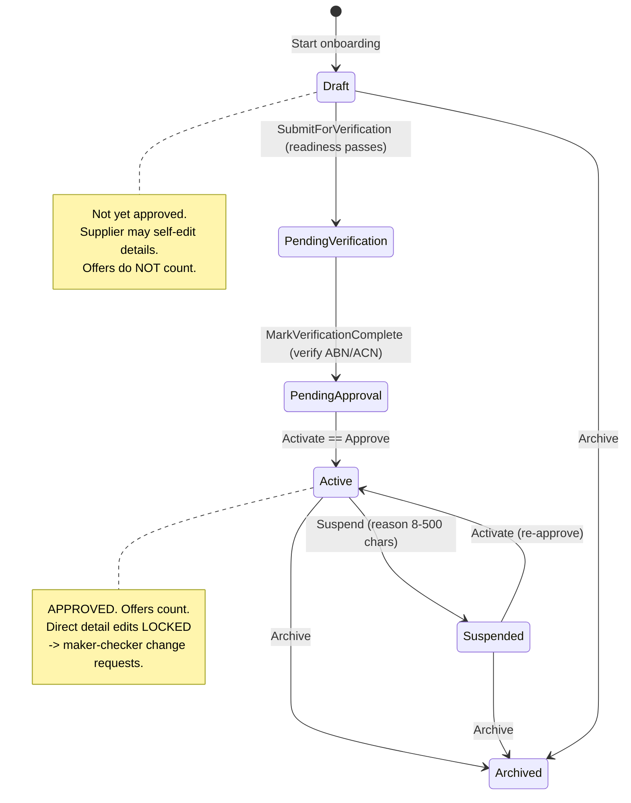
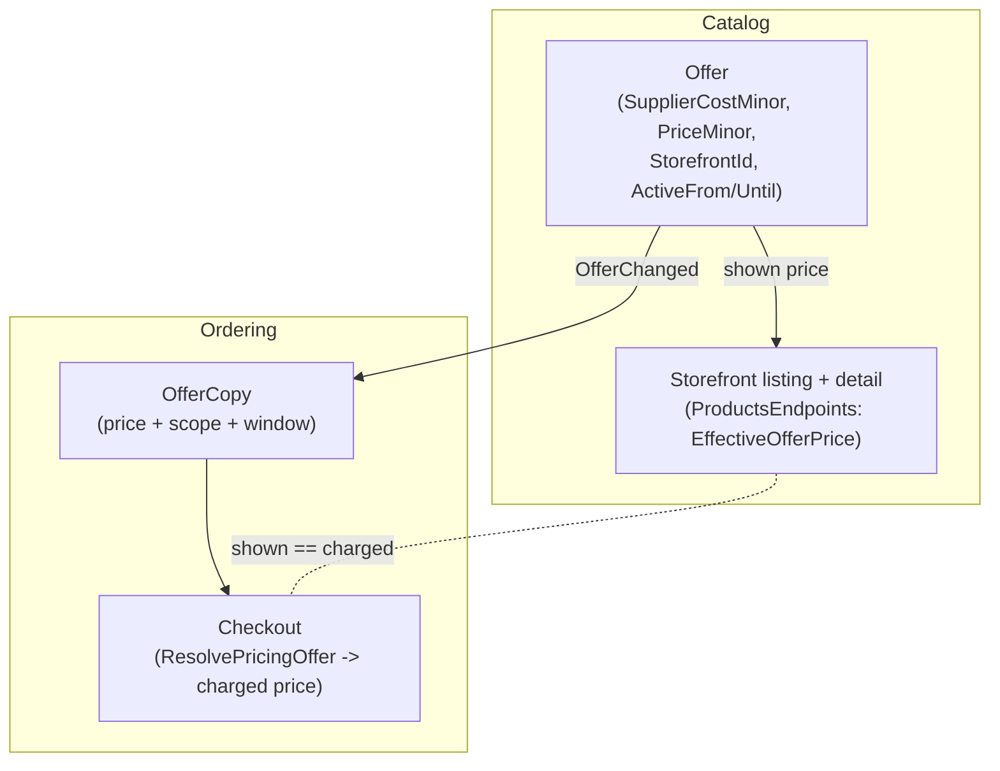

# Supplier functionality & management

How suppliers work end-to-end in 3commerce: what a supplier **is** (Entity master data), the
**lifecycle** it moves through, where an operator **manages and approves** it and edits its **cost**,
how a supplier **self-serves** its own details under an approval lock, how **Offers** turn a supplier
into a priced, storefront-scoped supply of a product, how **supplier approval gates availability**, and
how **warehouse collection** and **supplier-recorded delivery** work. Accurate to the code. The whole
supplier/offer epic is **shipped on `main`** — the Admin **Suppliers** console, Supplier Portal
self-service, storefront-scoped windowed offer price, approval-gated availability, and
warehouse/collect/mark-delivered are all merged.

> **One-line model.** A supplier is an **Entity** party record with a supplier profile and an onboarding
> state. It becomes sellable only when a tenant admin **approves** (activates) it. The link between a
> supplier and a product/variant is the **Offer** — the Offer owns both the **supplier cost** (COGS) and
> the **sell price**. See ADR-0027 (Entity boundary) and ADR-0028 (Offers).

## Contents

- [What a supplier is](#what-a-supplier-is)
- [Lifecycle](#lifecycle)
- [Admin: the Suppliers management page](#admin-the-suppliers-management-page)
- [Supplier self-service and the approval lock](#supplier-self-service-and-the-approval-lock)
- [Offers: cost vs price, storefront scope, active window](#offers-cost-vs-price-storefront-scope-active-window)
- [Approval-gated availability (Decision A)](#approval-gated-availability-decision-a)
- [Warehouses, collect-at-warehouse, and mark-delivered](#warehouses-collect-at-warehouse-and-mark-delivered)
- [Related ADRs and pages](#related-adrs-and-pages)

## What a supplier is

A supplier is **master data owned by the Entity service** (ADR-0027 — the entity master-data boundary).
It is an `EntityRecord` (a company, person, trust…) that carries a **supplier profile**
(`EntityRoleKind.Supplier`) and a `SupplierOnboarding` aggregate tracking its onboarding state and
`SupplierType` (e.g. warehouse partner, dropship). No other service owns supplier identity; Catalog,
Ordering, Payments and the portals reference a supplier by its Entity id and learn about it through
projected read copies (ADR-0008), never by cross-service query.

The **link from a supplier to a product/variant is the Offer** (Catalog, ADR-0028), uniquely keyed on the
**full five-part key** `(TenantId, ProductId, VariantId?, SupplierId, StorefrontId)`. One product/variant
can have many offers — a different **supplier** (multi-supplier) or a different **storefront**
(per-storefront pricing, ADR-0047) is a distinct offer — but the **exact same key repeated is a
duplicate**: `POST /api/catalog/admin/offers` rejects it with a clean **400** ("An offer already exists
for this tenant, product, variant, supplier and storefront…"), and the demo seed guards the same key so a
re-run yields exactly one offer per key. The Offer — not the supplier record — carries what the platform
pays the supplier (`SupplierCostMinor`, COGS) and what the shopper pays (`PriceMinor`, the sell price).

`src/Services/Entity/Domain/SupplierOnboarding.cs` · `src/Services/Catalog/Domain/Offer.cs`

## Lifecycle

A supplier is onboarded through the Entity `SupplierOnboarding` state machine. The tenant admin's
**Approve** action is the activation step — it is the gate that makes the supplier's offers sellable
(see [Approval-gated availability](#approval-gated-availability-decision-a)).

| State | Approved? | Supplier may self-edit details? | Offers sellable? |
|-------|-----------|--------------------------------|------------------|
| `Draft` | No | Yes (direct) | No |
| `PendingVerification` | No | Yes (direct) | No |
| `PendingApproval` | No | Yes (direct) | No |
| `Active` | **Yes** | No — via change request | **Yes** |
| `Suspended` | No (revoked) | No — via change request | No |
| `Archived` | No (revoked) | No | No |

**Readiness** to submit for verification (`SupplierOnboarding.CheckReadiness`): an active supplier
profile, a **verified** ABN or ACN identifier, a primary/operations **email** contact, and a current
registered-office or warehouse **address**. Suspending requires a reason of **8–500 characters**.

## Admin: the Suppliers management page

`/suppliers` — `src/Admin/Components/Pages/Suppliers.razor` (PR #241; grown into the complete console in
PR #249).

The **complete** operator surface for one supplier — everything that used to require the generic
Entities page now lives here. Pick a supplier from the list, then:

- **Edit details** — legal name and trading name, saved to the Entity record.
- **Identifiers** — view, add, and **verify** the entity's **ABN/ACN/GST/Other** identifiers (onboarding
  readiness needs a *verified* ABN or ACN).
- **Contacts** — view and add contact methods. An **exact-duplicate** contact (same purpose + kind +
  value, case-insensitive) is rejected with a clean 400 — the domain dedupe guard
  (`EntityRecord.AddContactMethod`), so re-adding "Operations · Email · ops@…" no longer produces a
  duplicate row.
- **Addresses** — view and add, including the **Warehouse** address (purpose 4).
- **Onboarding lifecycle** — submit-verification / verification-complete / activate / suspend / archive,
  with a **readiness banner**, plus the **Approve** shortcut below.
- **Change requests** — review and approve/reject this supplier's maker-checker change requests (subject
  to the tenant-admin self-approve exemption, ADR-0025 amendment).
- **Approve** — activates the supplier (`POST /api/entity/entities/{id}/suppliers/activate`). This is
  the same activation as the [lifecycle](#lifecycle) `PendingApproval → Active` step and is disabled once
  the supplier is already Active. Approving is what makes the supplier's offers count everywhere
  (ADR-0048).
- **Per-variant supplier cost** — a prominent, bordered, count-badged table lists every product/variant
  this supplier supplies (its Offers, loaded via
  `GET /api/catalog/admin/offers?tenantId=...&supplierId=...`, with a stable `ThenBy id` secondary sort)
  and lets the operator edit each row's **cost** (`Offer.SupplierCostMinor`, saved with
  `PUT /api/catalog/admin/offers/{id}`). A product-level offer (null variant) shows the product title;
  because offers are unique on the full `(Tenant, Product, Variant, Supplier, Storefront)` key, each
  product/variant appears exactly once.

> **The Suppliers page is the *only* place supplier cost is edited.** The supplier↔product/variant link
> is the Offer, so cost lives on the Offer and is edited here. It is shown **read-only** elsewhere (the
> Catalog product editor per variant, and the `/offers` Offer form). Cost is COGS — what the platform
> pays the supplier — and is denominated in the Offer's currency, never converted (no FX). It is distinct
> from the sell price (see below) and feeds the per-store COGS accrual (ADR-0041/0045) when an order paid
> against that offer confirms.

The `supplierId` filter on the Catalog offers list endpoint was added for this page
(`src/Services/Catalog/Api/Endpoints/OfferEndpoints.cs`).

Note the separate, pre-existing **Entities & suppliers** page (`/entities`) still runs the full
verification lifecycle (submit → verify → activate → suspend/archive) and the **change-request approval
queue**; the Suppliers page focuses on details, one-click approval, and cost. See
[Admin operations](./admin-operations.md).

## Supplier self-service and the approval lock

`src/SupplierPortal/Components/Pages/MyDetails.razor` (Supplier Portal, `:5300`; PR #242) —
`src/Services/Entity/Api/Endpoints/EntityEndpoints.cs` (`/entities/suppliers/me*`).

A supplier signs into the Supplier Portal and manages its **own** details, with behaviour gated by the
approval lock:

- **Before approval** (`Draft` / `PendingVerification` / `PendingApproval`) the supplier may **edit its
  details directly** (`PUT /api/entity/entities/suppliers/me`) and **add its own identifiers**
  (`POST /api/entity/entities/suppliers/me/identifiers`). My details renders the identifiers labelled
  **ABN/ACN/GST/Other** with their verification status.
- **Once approved** (`Active`, and thereafter `Suspended`/`Archived`) direct edits — details **and**
  identifiers — are **locked**. Every change must go through a **maker-checker `SupplierChangeRequest`**
  (ADR-0025): the supplier raises a request, and a tenant admin approves or rejects it in the Admin
  change-request queue. The two-person rule binds a **non-admin** requester (makers can't approve their
  own), but a **tenant admin may self-approve** their own request (ADR-0025 amendment, 2026-08-28).
  Approving an entity-details request **applies** the proposed legal/trading name to the supplier record;
  rejection requires a reason.

The lock is enforced **server-side** in the domain (`SupplierOnboarding.EnsureDirectDetailEditAllowed`),
not just hidden in the portal UI — calling the API directly after approval is rejected with
*"This supplier is approved; details can no longer be edited directly. Raise a change request instead."*
The portal's `Requests.razor` lists the supplier's own change-request history.

`src/Services/Entity/Domain/SupplierOnboarding.cs` (`AllowsDirectDetailEdit`) ·
`src/Services/Entity/Infrastructure/SupplierChangeRequestService.cs`

## Offers: cost vs price, storefront scope, active window

An **Offer** (ADR-0028) is how a `(product, variant)` is sourced from a specific supplier — its supply
category + fulfilment type — and the price it sells at. Operators create one on the Admin **Offers &
pricing** page (`/offers`), whose New-offer form picks **Product**, **Variant**, and **Supplier** from
**live-data dropdowns** (not raw GUIDs): the variant `<select>` is dependent on the chosen product and
carries an explicit **"(all variants)"** option for a product-level offer (`VariantId = null`). All three
are immutable after creation. Two distinct money fields:

| Field | Meaning | Edited where |
|-------|---------|--------------|
| `SupplierCostMinor` | **COGS** — what the platform pays the supplier per unit | Admin **Suppliers** page only (read-only elsewhere) |
| `PriceMinor` | **Sell price** — what the shopper pays per unit | `/offers` Offer form |

**Storefront-scoped, active-window sell price (ADR-0047 — shipped).** The Offer gains nullable
`StorefrontId` (null = all storefronts of its currency) and nullable `ActiveFrom` / `ActiveUntil` (UTC,
inclusive; null = open-ended). When an offer is **active, in-window, and matches a line's storefront +
currency**, its `PriceMinor` is the **authoritative charge at checkout** *and* the **price shown on the
storefront** — shown == charged. Because a storefront's currency is 1:1 (ADR-0038), "per currency + per
storefront" collapses to per-storefront.

Resolution precedence (both at checkout and on the storefront): a **variant-specific** offer beats a
product-level one → a **storefront-scoped** offer beats an all-storefront one → lowest `Priority` wins.
The offer price overrides the catalog shelf price **without** tripping checkout's price-drift 409 (the
shopper saw exactly that price). When no offer is effective, checkout keeps the catalog
`SellingPriceMinor` / per-currency `VariantPrice` (ADR-0038).

Charged: `src/Services/Ordering/Api/Endpoints/CheckoutEndpoints.cs` +
`src/Services/Ordering/Domain/OfferCopy.cs` (`ResolvePricingOffer`). Shown:
`src/Services/Catalog/Api/Endpoints/ProductsEndpoints.cs` (`EffectiveOfferPrice`). Projection:
`OfferChanged` (`src/BuildingBlocks/Contracts/Catalog/OfferChanged.cs`).

## Approval-gated availability (Decision A)

**ADR-0048, Decision A (strict) — shipped.** An offer backed by
an **unapproved** supplier (any state other than `Active`) **never counts** — no storefront price, no
availability, no checkout — **regardless of fulfilment type or on-hand stock**. Even owned-warehouse stock
behind an unapproved supplier's offer does not sell. A variant is **unavailable unless another *approved*
offer covers it**. A product/variant with **no** covering offer keeps its normal catalog behaviour — there
is no supplier to gate (the offerless scope guard).

Approval status reaches Catalog and Ordering by projection, never by cross-service query (ADR-0008): the
Entity service publishes **`SupplierApprovalChanged(TenantId, SupplierId, Approved)`** when a supplier is
activated (`Approved = true`), suspended, or archived-while-active (`Approved = false`), inside the same
transaction as the state change. Catalog and Ordering each project it into a local
`SupplierApprovalCopy` read model that offer resolution and storefront availability gate on. How each side
enforces it:

- **Catalog storefront listing + detail** (`ProductsEndpoints`, consumer `SupplierApprovalConsumer`): a
  product whose covering offers (this store + currency) are **all** from unapproved suppliers is dropped
  from the listing; on the product detail a such variant is returned **unavailable** (out-of-stock) even
  if it has stock; and only an **approved** offer can set the shown offer price.
- **Ordering checkout** (`CheckoutEndpoints`, consumer `SupplierApprovalChangedConsumer`): an
  `approvedSupplierIds` set is threaded through every offer resolution — pricing, fulfilment, the shipping
  gate, recurring-line detection, and the order line's supplier ref. A line whose only covering offer is
  unapproved is **rejected**: *"… is currently unavailable and was removed; its supplier is not approved."*
  `OfferResolution` takes an optional `approvedSupplierIds`; passing null leaves resolution ungated for
  paths where the supplier is already known-approved (e.g. a persisted order line gated at checkout).

## Warehouses, collect-at-warehouse, and mark-delivered

**Shipped.** See ADR-0049. Three connected capabilities:

- **Warehouse details, supplier-managed under the approval lock.** A supplier that backs `Warehouse`
  fulfilment manages its warehouse address on the Supplier Portal **Warehouse** page
  (`src/SupplierPortal/Components/Pages/Warehouse.razor`; `GET/PUT /api/entity/entities/suppliers/me/warehouse`).
  It is a `Warehouse`-purpose Entity address governed by the **same approval lock** as
  [self-service](#supplier-self-service-and-the-approval-lock): edited **directly** before approval, and
  via a maker-checker change request afterwards — a new **`SupplierChangeRequestType.WarehouseAddress`**
  (type 5). Entity publishes **`SupplierWarehouseChanged`** on set/edit/approved-change; Ordering projects
  it into a local `SupplierWarehouseCopy` read model (ADR-0008) so checkout can record the warehouse
  address without querying Entity.
- **"Collect at warehouse" checkout option.** The checkout request carries `CollectAtWarehouse`. It is
  eligible only when the cart has at least one **physical `Warehouse`-fulfilment line from an *approved*
  supplier** (ADR-0048); an ineligible collect request is rejected so the client falls back to a shipped
  rate. A collect order sets **`ShippingMinor = 0`**, selects **no carrier**, skips carrier-rate
  validation, and snapshots the warehouse it is collected from onto the order (`Order.CollectAtWarehouse`
  + `Warehouse*` fields). This is the pickup counterpart to the "only shippable carts pay shipping" rule
  (ADR-0042); normal shipped/dropship flows are untouched. Storefront:
  `src/Storefront/components/checkout/CheckoutForm.tsx`; server:
  `src/Services/Ordering/Api/Endpoints/CheckoutEndpoints.cs`.
- **Supplier "mark as delivered".** `OrderStatus` gains a terminal **`Delivered`**. A supplier sees the
  orders it fulfils on the Supplier Portal **Orders** page (`Components/Pages/Orders.razor`;
  `GET /api/ordering/orders/supplier/me`) and marks one delivered via
  **`POST /api/ordering/orders/supplier/{id}/mark-delivered`**. The action transitions `Confirmed →
  Delivered` and publishes **`OrderDelivered`**; it is **idempotent** (an already-delivered order returns
  200) and **authorized to the fulfilling supplier only** (a line's `SupplierId` matching the caller's
  self-scoped `supplier_entity`) or an operator. Fulfillment consumes `OrderDelivered` and closes the
  order's shipments (`ShipmentStatus.Delivered`), including a collect order's warehouse shipment;
  Notifications sends the confirmation.

Built on the portal + approval lock and approval-gated availability.

## Related ADRs and pages

| Reference | Why it matters here |
|-----------|--------------------|
| [ADR-0027](../adr/0027-entity-service-master-data-boundary.md) | Entity owns supplier master data — the boundary this page's model sits on |
| [ADR-0028](../adr/0028-product-supply-profiles-composable-supply.md) | The Offer — supplier↔product link, cost + price ownership |
| [ADR-0038](../adr/0038-per-currency-shelf-prices-and-tax-entry.md) | Per-currency shelf prices; storefront currency is 1:1 (why per-storefront pricing collapses from per-currency) |
| [ADR-0047](../adr/0047-storefront-scoped-active-window-offer-price.md) | Storefront-scoped, active-window Offer price — charged and shown |
| [ADR-0048](../adr/0048-supplier-approval-gated-offer-availability.md) | Supplier-approval-gated offer validity & availability (Decision A) |
| [ADR-0049](../adr/0049-warehouse-collection-and-supplier-recorded-delivery.md) | Warehouse collection at checkout + supplier-recorded delivery |
| [ADR-0042](../adr/0042-physical-shipping-carriers-and-product-type-policy.md) | Only shippable carts pay shipping — the rule collect-at-warehouse mirrors for pickup |
| [ADR-0025](../adr/0025-pdp-pep-dynamic-rbac.md) | Maker-checker change requests behind the approval lock (incl. warehouse-address changes) |
| [ADR-0040](../adr/0040-per-currency-per-storefront-ledger.md) / [ADR-0041](../adr/0041-per-store-order-costs-chargebacks-and-estimated-margin.md) / [ADR-0045](../adr/0045-mandatory-per-storefront-ledger-attribution.md) | Per-storefront ledger + COGS accrual — where supplier cost and per-store attribution land |
| [Admin operations](./admin-operations.md) | The Suppliers, Offers & pricing, Entities & suppliers, and Supplier Payouts admin screens |
| [Selling information](./selling-information.md) | The strategic supplier/offer narrative |
